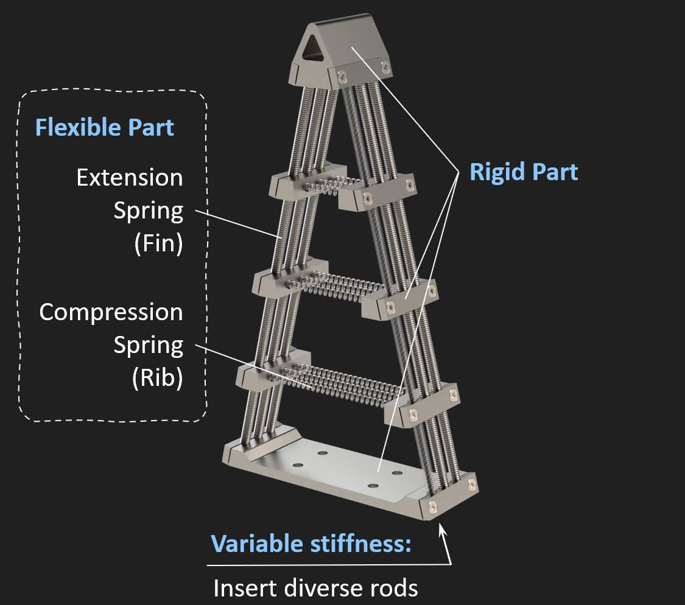
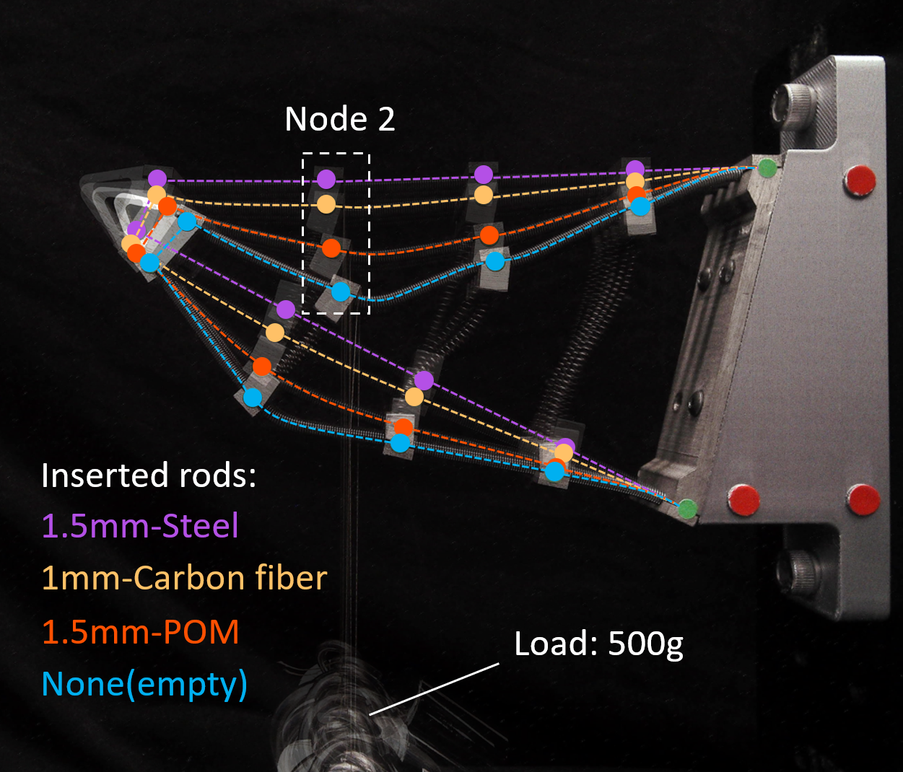
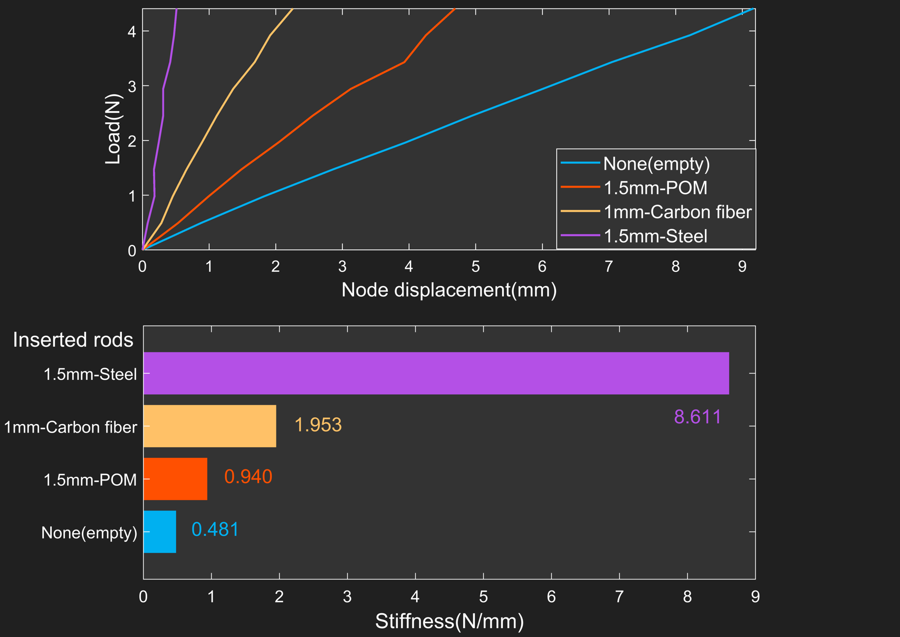

*Participant responsible for the mechanical design and experimental validation.*

## Background

    Soft robotic grippers are typically fabricated from higly elastic materials such as silicone and thermoplastic polyurethane (TPU). These materials provide excellent flexibility, enabling the grippers to adaptively grasp and manipulate objects of various shapes. However, such flexible materials are prone to failure under extreme environmental conditions. For instance, they tend to become brittle at very low temperatures, may melt at ultra-high temperatures, and are susceptible to corrosion when exposed to strongly acidic or alkaline environments. Currently, there is a lack of soft grippers capable of operating reliably under such harsh conditions.

    This project aims to develop a noval soft gripper to address these limitations, particularly the material failures of existing soft grippers when used in extreme environments. The designed soft gripper is expected to operate reliably across a wider range of temperatures and pH levels.

## Design

    Given that high-temperature alloys can withstand a broader range of temperatures and chemical environments, this project developes a fully metal-made fin ray gripper, with the finger design illustrated in Fig.1. Due to the high cost of high-temperature alloys, spring steel (flexible parts) and stainless steel (rigid parts) are used as substitues in the fabrication of the prototype. Extension spring are employed due to the fin's tensile deformation when finger bending. To ensure stability during deformation, compression springs are utilized as rib to provide structural support.

    To accommodate various grasping and manipulation tasks, flexible fingers need to possess variable stiffness. In this project, variable stiffness is achieved by utilizing the inner cavity of the extension springs. By inserting rods of different materials and diameters into the interior of the extension springs, the overall stiffness of the flexible finger can be adjusted accordingly.

<figure>
    
    <figcaption style="font-size:16px">Fig.1. The finger design based on fin ray effects.
</figure>

## Multiple Stiffness Measurement

    At the same position on the flexible finger (taking Node2 as an example), weights ranging from 50g to 500g are applied incrementally in steps of 50g. The coordinates of the finger node are measured using a camera, allowing the stiffness at the loading node to be calculated. The measurement is repeated for the finger with different inserted rods. A comparison of the finger deformation under a 500g load at Node 2 is presented in Fig.2, and the corresponding stiffness measurement results are shown in Fig.3. The results demonstrate that with different inserted rods, the finger can achieve a wide range of variable stiffness.

<figure>
    
    <figcaption style="font-size:16px">Fig.2. Comparison of the finger deformation under a 500g load at Node 2 with different inserted rods.
</figure>

<figure>
    
    <figcaption style="font-size:16px">Fig.3 Results of stiffness measurement at Node 2.
</figure>

## Grasping Experiments

<!-- html：图片矩阵 -->

    

        
        
        
        
        
        
        
        
        
        
  

  
Fig.4. Grasping experiments on 10 different objects.

