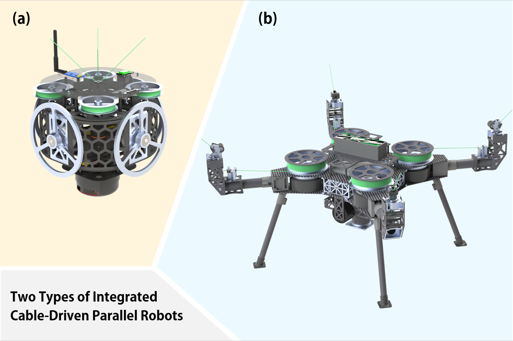
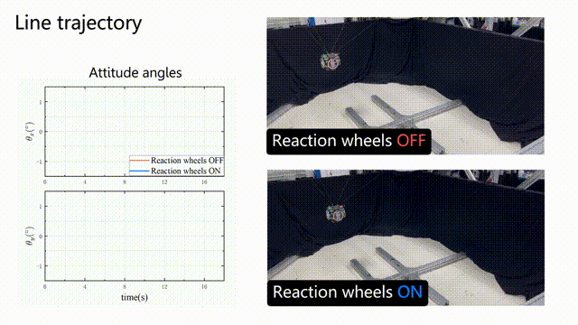

*Indivisual research during the master's degree.*

## Background

<!-- html：段落两端对齐 -->

  In traditional cable-driven parallel robots (CDPRs), the cable-driving units are sperated from the moving platform and are installed on a fixed frame which is typically constructed of steel or aluminum. In this case, if a large workspace is needed, the whole system would be very large heavy. It is also complicated for deployment and hard to change the workspace. 

  To overcome these limitations, this project aims to develop portable CDPRs that are highly <b>integrated</b>, <b>compact</b>, and <b>light weight</b>, facilitating carrying, transportation, and deployment. 

## Design

Two types of integrated CDPRs are designed in this project, as shown in Fig.1. Type (a) has a smaller size and lighter weight and is designed for inspection tasks. While type (b) has a higher payload and is intended for pick-and-place. Both types of CDPRs feature a compact structure and can be rapidly deployed.

<!-- html：图片与标题 -->
<figure>
  
  <figcaption style="font-size:16px">Fig.1. Two types of integrated CDPRs.
</figure>

## Current Research

  My current research primarily focuses on the development of the smaller and lighter type, as shown in Fig.1(a). The proposed CDPR is an underactuated system, where undesired oscillations significantly affect the stability and precision of the end-effector. To actively suppress these oscillations, we draw inspiration from related studies and integrate reaction wheels into the system. The dynamics of the CDPR with reaction wheels are modeled to determine the parameters of reaction wheel module and to further develop the controller. With the implementation of reaction wheels, the motion stability of the robot is significantly enhanced, and the trajectory tracking accuracy of the end-effector is improved by approximately 60%.

A trajectory tracking experiment was conducted to validate the effectiveness of reaction wheels, as shown below. For more details, please click [**here**](../../publication/portablecdpr/).

<figure>
  
  <figcaption style="font-size:16px">Fig.2. A line trajectory tracking experiment.
</figure>

## Further Research

  Rapid deployment is a key feature of integrated CDPRs. Following deployment, the precise positions of the anchors must be known for accurate kinematic and dynamic modeling, which necessitates a calibration process. Traditional calibration methods typically rely on external devices, such as laser tracking systems, to measure anchor positions. However, these approaches are often costly and may become impractical in large workspaces. Therefore, a self-calibration method is essential to enable integrated CDPRs to be more effectively applied in real-world scenarios. Furthermore, we are actively exploring the potential for self-deployment capabilities in integrated CDPRs, aiming to achieve fully autonomous setup and operation.

