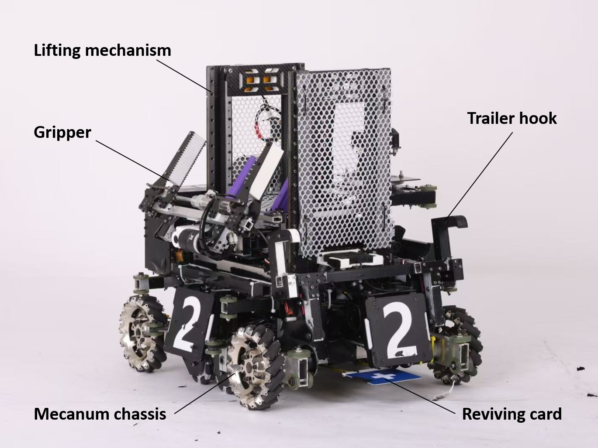

*Mechanical designer of the engineer robot.*

## Background

    The RoboMaster University Series is a platform for robotic competitions and academic exchange, specially designed for global technology enthusiasts. The RoboMaster University Championship (RMUC) gives participants the opportunity to comprehensively improve their practical engineering skills, integrating various robotics-related disciplines such as machine vision, embedded system design, mechanical engineering,  and human-machine interaction. In RMUC 2021, I was responsible for the mechanical design of the engineer robot which competed for minerals to gain economic advantages in the matches.

For more information about RoboMaster, please click [**here**](https://www.robomaster.com/en-US/robo/overview?djifrom=nav).

## Design

    The overall design is shown in Fig.1. The designed engineer robot consists of a lifting mechanism, a gripper, a mecanum wheel chassis, a trailer hook, and a reviving card. The lifting mechanism enables the ajustment of the gripper's position to grasp minerals at various heights. The chassis is designed with mecanum wheels for omnidirectional mobility. To rescue disabled robots on the field, a trailer hook is equipped to tow them back to the base zone. Additionally, a reviving card allows the robot to be revived in situ.

<figure>
    
    <figcaption style="font-size:16px">Fig.1. Overall design of the engineer robot.
</figure>

    The major task of the engineer robot is to pick the minerals which rest in a random position on the resource island. Fig.2 shows how the engineer robot lifts the gripper and reach out for the mineral. 

<figure>
    
    <figcaption style="font-size:16px">Fig.2. Picking the mineral in the match.
</figure>

    The reviving card should be stretched out to the bottom of the disabled robots to revive them, and retracted afterwards. In the designed engineer robot, the reviving card is mounted on a telescopic mechanism using tape springs, as shown in Fig.3.

<figure>
    
    <figcaption style="font-size:16px">Fig.3. Telescoping of the reviving card.
</figure>

