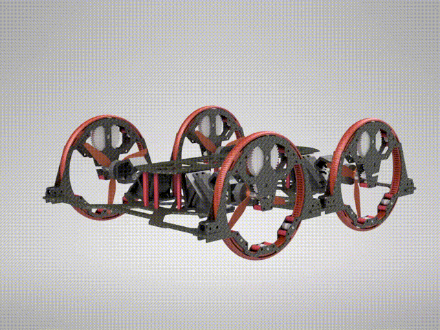
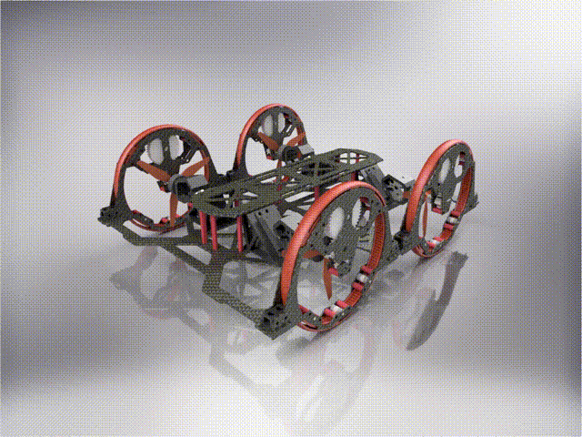
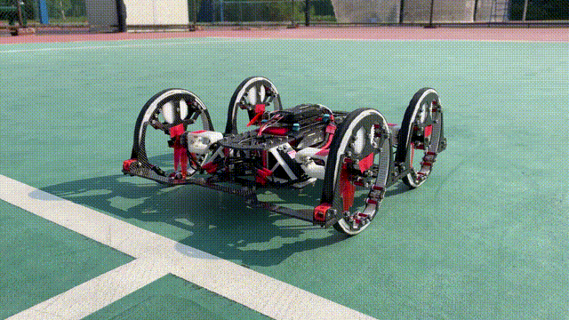

*Leader of the project.*

## Background

    This project was carried out by Haowei Yi and me during our freshman year. It aimed to develop a ground-aerial amphibious robot capable of both ground locomotion and aerial flight to overcome obstacles. The proposed robot, named <i>Ropter</i> — a combination of "rover" and "copter" — features a unique actuation system in which the wheels and rotor blades share the same set of motors.

## Design

    The overall design of Ropter is shown in Fig.1. Each wheel of Ropter is designed with an internal gear and a set of reduction gears. The head of the rotor blade is equipped with a gear as well. In ground mode, the gear engages with the wheel's reduction gear set, thereby driving the wheel. To switch to flight mode, teh rotor blades are rotated to a horizontal position, allowing the robot to function as a quadrotor UAV.

<!-- html：图片矩阵 -->

    

        

            
            
(a) Gear drive of the wheel. 

        

        

            
            
(b) Morphing from ground mode to aerial mode. 

        

    

    
Fig.1. Overall design of Ropter.

<figure>
    
    <figcaption style="font-size:16px">Fig.2. The morphing process in reality.
</figure>

## Video

